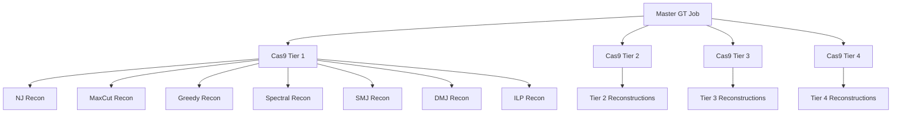

# LSF Cascading Jobs System - User Manual

## Overview

This system performs large-scale phylogenetic reconstruction analysis using a cascading LSF (Load Sharing Facility) job architecture. It generates ground truth trees, applies multi-tier Cas9 recording simulations, and performs comprehensive reconstruction analysis across multiple solvers.

**Architecture**: Jobs submit other jobs in a master-worker pattern with 3 levels:
- **Level 1**: Master GT job (1 job)
- **Level 2**: Cas9 recording jobs (4 jobs) 
- **Level 3**: Reconstruction jobs (28 jobs)
- **Total**: 33 jobs producing statistical analysis across 4 recording quality tiers

---

## Quick Start Guide

### 1. **Launch the Analysis**
```bash
# Test locally first (recommended)
python launch_cascade.py --local_test

# Launch on LSF cluster
python launch_cascade.py --shared_dir /path/to/shared/storage
```

### 2. **Monitor Progress**
```bash
# Check status once
python job_monitor.py --shared_dir /path/to/shared/storage

# Monitor continuously (updates every 60 seconds)
python job_monitor.py --shared_dir /path/to/shared/storage --continuous

# Check only failures
python job_monitor.py --failures_only
```

### 3. **Check Results**
Results are saved in `/shared/cas9_analysis/results/`:
- `tier1_nj_metrics.json`, `tier1_maxcut_metrics.json`, etc.
- `aggregated/final_results.csv` (when complete)

---

## System Components

### Core Scripts

| Script | Purpose | Level |
|--------|---------|-------|
| `launch_cascade.py` | Entry point - launches entire system | Entry |
| `master_gt_worker.py` | Generates GT tree, submits Cas9 jobs | Level 1 |
| `cas9_recording_worker.py` | Applies Cas9 recording, submits reconstruction jobs | Level 2 |
| `reconstruction_worker.py` | Performs reconstruction and calculates metrics | Level 3 |
| `job_monitor.py` | Status monitoring and progress tracking | Monitor |

### Job Templates

| Template | Purpose |
|----------|---------|
| `jobs/master_gt_job.lsf` | LSF script for GT generation |
| `jobs/cas9_recording_job_template.lsf` | Template for Cas9 recording jobs |
| `jobs/reconstruction_job_template.lsf` | Template for reconstruction jobs |

---

## Detailed Usage

### Launch Script (`launch_cascade.py`)

**Basic Usage:**
```bash
python launch_cascade.py [options]
```

**Options:**
- `--shared_dir PATH` - Shared directory for distributed computing (default: `/shared/cas9_analysis`)
- `--setup_only` - Only set up directories, don't submit jobs
- `--local_test` - Run locally for testing (not on LSF)

**Examples:**
```bash
# Standard launch
python launch_cascade.py --shared_dir /scratch/user/cas9_analysis

# Setup directories only
python launch_cascade.py --setup_only

# Local testing
python launch_cascade.py --local_test
```

### Job Monitor (`job_monitor.py`)

**Basic Usage:**
```bash
python job_monitor.py [options]
```

**Options:**
- `--shared_dir PATH` - Shared directory path
- `--continuous` - Run continuous monitoring
- `--interval SECONDS` - Monitoring interval (default: 60)
- `--failures_only` - Only report failures

**Examples:**
```bash
# Single status check
python job_monitor.py

# Continuous monitoring every 30 seconds
python job_monitor.py --continuous --interval 30

# Check for failures only
python job_monitor.py --failures_only
```

**Monitor Output:**
```
📊 LSF CASCADING JOB SYSTEM STATUS REPORT
===============================================================
🕐 Timestamp: 2024-01-15T14:30:00

📈 OVERALL PROGRESS
   Completed: 25/33 (75.8%)
   Failed:    1/33 (3.0%)

🌳 Level 1: GT Generation
   ✅ Completed: 1/1

🧬 Level 2: Cas9 Recording
   ✅ Completed: 4/4

🔧 Level 3: Reconstruction
   ✅ Completed: 20/28
   ❌ Failed: 1/28
      Failed components: tier3_ilp

📁 FILE OUTPUTS
   GT Tree: ✅
   Cas9 Instances: 4/4 tiers
   Result Files: 27/28 reconstructions
```

---

## File Structure

### Shared Directory Layout
```
/shared/cas9_analysis/
├── jobs/                          # LSF job scripts
│   ├── master_gt_job.lsf
│   └── ...templates...
├── logs/                          # LSF job logs
│   ├── master_gt_12345.out
│   ├── cas9_tier1_12346.out
│   └── reconstruct_tier1_nj_12347.out
├── status/                        # Job status tracking
│   ├── level1_status.json         # GT generation status
│   ├── level2_status.json         # Cas9 recording status
│   ├── level3_status.json         # Reconstruction status
│   └── overall_status.json        # Complete status summary
├── gt_trees/
│   └── gt_tree.pkl               # Ground truth tree
├── cas9_instances/
│   ├── tier1_instance.pkl        # Cas9 recordings
│   ├── tier2_instance.pkl
│   ├── tier3_instance.pkl
│   └── tier4_instance.pkl
├── results/
│   ├── tier1_nj_metrics.json     # Individual results
│   ├── tier1_maxcut_metrics.json
│   ├── ... (28 total files)
│   └── tier4_ilp_metrics.json
└── aggregated/
    ├── final_results.csv          # Combined results
    ├── statistical_summary.json   # Statistical analysis
    └── performance_analysis.pkl   # Performance metrics
```

### Result Files Format

Each reconstruction produces a JSON file with:
```json
{
  "reconstruction_id": "tier2_maxcut_001",
  "Cas9_tier": 2,
  "Cas9_tier_name": "Tier 2 - High Fidelity",
  "recording_sites": 1000,
  "solver": "maxcut",
  "triplets_distance": 0.0234,
  "RF_distance": 12,
  "parsimony_score": 456,
  "cPHS": 0.001234,
  "likelihood_score": -2345.67,
  "computation_time_seconds": 45.2
}
```

---

## Job Flow and Dependencies

### Cascading Job Architecture


### Job Submission Flow
1. **User submits Master GT job** → LSF queue
2. **Master GT job runs** → generates GT tree → submits 4 Cas9 jobs
3. **Each Cas9 job runs** → applies recording → submits 7 reconstruction jobs
4. **28 reconstruction jobs run** → perform analysis → save results
5. **Monitor tracks progress** → provides status updates

---

## Troubleshooting

### Common Issues

**❌ "Master job failed to submit"**
- Check LSF is available: `bjobs`
- Verify shared directory permissions
- Check job script paths exist

**❌ "No LSF jobs found"** 
- Jobs may have completed quickly
- Check log files in `logs/` directory
- Use `bjobs -a` to see all recent jobs

**❌ "Missing input files"**
- Previous level jobs may have failed
- Check status files: `cat /shared/cas9_analysis/status/level*_status.json`
- Look for failed components in monitor output

**❌ "Reconstruction failed"**
- Check solver is supported: `nj`, `maxcut`, `greedy`, `spectral`, `smj`, `dmj`, `ilp`
- Verify stellars library is available
- Check memory limits in job templates

### Recovery Procedures

**Restart Failed Components:**
```bash
# Check what failed
python job_monitor.py --failures_only

# For failed GT generation - resubmit master job
bsub jobs/master_gt_job.lsf

# For failed Cas9 recording (example: tier 2)
python cas9_recording_worker.py \
    --gt_tree_path /shared/cas9_analysis/gt_trees/gt_tree.pkl \
    --tier 2 \
    --output_dir /shared/cas9_analysis/cas9_instances \
    --shared_dir /shared/cas9_analysis

# For failed reconstruction (example: tier 3, ilp solver)
python reconstruction_worker.py \
    --cas9_instance_path /shared/cas9_analysis/cas9_instances/tier3_instance.pkl \
    --solver ilp \
    --tier 3 \
    --output_dir /shared/cas9_analysis/results \
    --shared_dir /shared/cas9_analysis
```

### Debugging

**Check Job Logs:**
```bash
# Master GT job logs
ls /shared/cas9_analysis/logs/master_gt_*.out
tail /shared/cas9_analysis/logs/master_gt_12345.out

# Cas9 recording logs
ls /shared/cas9_analysis/logs/cas9_tier*_*.out

# Reconstruction logs  
ls /shared/cas9_analysis/logs/reconstruct_*.out
```

**Check Status Files:**
```bash
# Overall status
cat /shared/cas9_analysis/status/overall_status.json | jq .

# Level-specific status
cat /shared/cas9_analysis/status/level1_status.json
cat /shared/cas9_analysis/status/level2_status.json
cat /shared/cas9_analysis/status/level3_status.json
```

**Verify LSF Job Status:**
```bash
# Current jobs
bjobs

# All recent jobs
bjobs -a

# Specific job details
bjobs -l 12345
```

---

## Configuration

### Cas9 Tier Settings

The system uses 4 predefined Cas9 recording tiers:

| Tier | Name | Recording Sites | States/Site | Mutation Pattern |
|------|------|----------------|-------------|------------------|
| 1 | Ultra High Fidelity | 5,000 | 50 | Time-scaled exponential |
| 2 | High Fidelity | 1,000 | 30 | Sinusoidal variation |
| 3 | Medium Fidelity | 200 | 20 | Periodic (0.7, 1.0, 1.3) |
| 4 | Low Fidelity | 15 | 10 | Uniform (0.8) |

### Solvers

Seven reconstruction solvers are used:
- `nj` - Neighbor Joining
- `maxcut` - Maximum Cut
- `greedy` - Greedy Algorithm
- `spectral` - Spectral Method
- `smj` - Symmetric Maximum Join
- `dmj` - Dynamic Maximum Join  
- `ilp` - Integer Linear Programming

### Resource Requirements

**Per Job:**
- **GT Generation**: 1 hour, 8GB RAM
- **Cas9 Recording**: 30 minutes, 6GB RAM
- **Reconstruction**: 45 minutes, 4GB RAM

**Total Cluster Usage:**
- **Peak concurrent jobs**: ~30
- **Total CPU-hours**: ~50-100 hours
- **Storage**: ~10-20 GB
- **Runtime**: 2-3 hours (with parallelization)

---

## Advanced Usage

### Scaling to Multiple GT Trees

To analyze multiple GT trees, modify `launch_cascade.py` to submit multiple master jobs:

```python
# Submit multiple master GT jobs
for gt_id in range(10):  # 10 GT trees
    shared_dir = f"/shared/cas9_analysis_gt{gt_id}"
    # Launch separate cascade for each GT tree
```

### Custom Analysis Parameters

Modify `reconstruction_metrics_table_multi_tier.py` to adjust:
- Tree sizes (number of cells)
- Cas9 tier configurations  
- Additional solvers
- Different metrics

### Integration with Other Systems

The system produces standardized JSON outputs that can be consumed by:
- R/Python analysis scripts
- Visualization dashboards
- Statistical analysis pipelines
- Machine learning workflows

---

## Performance Tips

1. **Storage**: Use high-performance shared storage (e.g., Lustre, GPFS)
2. **Memory**: Monitor job memory usage, adjust limits if needed
3. **Parallelization**: System automatically maximizes parallelism
4. **Monitoring**: Run continuous monitoring to catch failures early
5. **Cleanup**: Remove intermediate files after successful completion

---

## Support

**Check logs first:**
- LSF logs: `/shared/cas9_analysis/logs/`
- Status files: `/shared/cas9_analysis/status/`

**Common commands:**
- `bjobs` - Check LSF job status
- `python job_monitor.py` - Check system status
- `tail -f logs/master_gt_*.out` - Follow job progress

**File locations:**
- All scripts: Current directory
- Job templates: `jobs/` directory
- Results: `/shared/cas9_analysis/results/`

This system provides a robust, scalable framework for large-scale phylogenetic reconstruction analysis with comprehensive monitoring and fault tolerance.