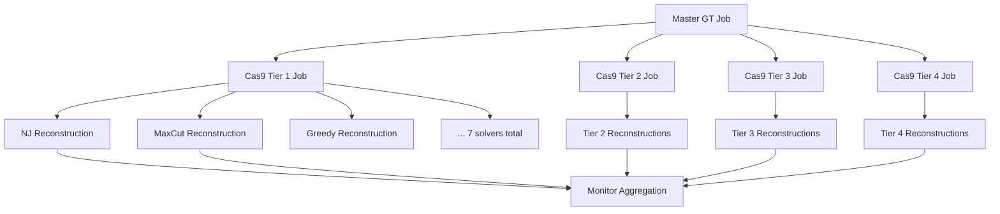

# LSF Distributed Computing Strategy for Multi-Tier Cas9 Analysis

## Overview

This document outlines the strategy for scaling up the multi-tier Cas9 reconstruction analysis using LSF (Load Sharing Facility) distributed computing. The goal is to generate statistically robust results with many GT trees and instances.

## Current vs. Scaled Analysis

### **Current Scale (Single Machine)**
- 4 Cas9 tiers × 4 instances × 7 solvers = **112 reconstructions**
- Runtime: ~30-60 minutes
- Limited statistical power

### **Proposed Scale (LSF Cluster)**
- 4 Cas9 tiers × **50+ instances** × 7 solvers = **1,400+ reconstructions**
- Runtime: ~1-2 hours (parallelized)
- High statistical power with confidence intervals

## Distributed Computing Strategy: Cascading Job Submission

### **Master-Worker Job Chain Pattern**

The strategy uses a **cascading job submission** pattern where each level submits jobs for the next level:

```
Level 1: Master GT Job
└── master_gt_job.lsf  → Generates GT tree + submits Level 2 jobs

Level 2: Cas9 Recording Jobs (submitted by Level 1)
├── cas9_tier1_gt.lsf → Apply Tier 1 + submit reconstruction jobs
├── cas9_tier2_gt.lsf → Apply Tier 2 + submit reconstruction jobs  
├── cas9_tier3_gt.lsf → Apply Tier 3 + submit reconstruction jobs
└── cas9_tier4_gt.lsf → Apply Tier 4 + submit reconstruction jobs

Level 3: Reconstruction Jobs (submitted by Level 2)  
├── reconstruct_nj_tier1.lsf
├── reconstruct_maxcut_tier1.lsf
├── reconstruct_greedy_tier1.lsf
└── ... (7 solvers per tier = 28 total reconstruction jobs)
```

### **Key Differences from Centralized Approach**

| **Centralized Coordinator** | **Cascading Job Submission** |
|------------------------------|-------------------------------|
| Single coordinator submits all jobs | Jobs submit their successor jobs |
| Fixed dependency chain | Dynamic job creation |
| Coordinator manages all state | Distributed job management |
| Single point of failure | Fault tolerant by design |
| Manual job parameter generation | Jobs generate their own parameters |

## Implementation Architecture

### **Level 1: Master GT Job (`master_gt_job.lsf`)**

```bash
#BSUB -J master_gt_analysis
#BSUB -o logs/master_gt_%J.out
#BSUB -e logs/master_gt_%J.err
#BSUB -W 1:00  # 1 hour
#BSUB -n 1
#BSUB -M 8000  # 8GB memory

# Generate GT tree and submit Cas9 recording jobs
python master_gt_worker.py --n_gt_trees 1 --output_dir /shared/gt_trees/
```

**Master GT Worker (`master_gt_worker.py`)**:
```python
class MasterGTWorker:
    def __init__(self, n_gt_trees=1, cas9_tiers=4):
        self.n_gt_trees = n_gt_trees
        self.cas9_tiers = cas9_tiers
        
    def generate_gt_tree(self):
        # Generate ground truth tree
        
    def submit_cas9_jobs(self):
        # Submit one job per Cas9 tier
        for tier in range(1, self.cas9_tiers + 1):
            self.submit_cas9_job(tier)
            
    def submit_cas9_job(self, tier):
        # Submit LSF job for this Cas9 tier
        subprocess.run([
            'bsub', 
            f'/shared/jobs/cas9_tier{tier}_job.lsf',
            f'--gt_tree_path', gt_tree_path,
            f'--tier', str(tier)
        ])
```

### **Level 2: Cas9 Recording Jobs (`cas9_tierN_job.lsf`)**

```bash
#BSUB -J cas9_tier1_analysis
#BSUB -o logs/cas9_tier1_%J.out
#BSUB -e logs/cas9_tier1_%J.err
#BSUB -W 0:30  # 30 minutes
#BSUB -n 1
#BSUB -M 6000  # 6GB memory

# Apply Cas9 recording and submit reconstruction jobs
python cas9_recording_worker.py --gt_tree_path $1 --tier $2 --output_dir /shared/cas9_instances/
```

**Cas9 Recording Worker (`cas9_recording_worker.py`)**:
```python
class Cas9RecordingWorker:
    def __init__(self, gt_tree_path, tier, solvers=7):
        self.gt_tree_path = gt_tree_path
        self.tier = tier
        self.solvers = ['nj', 'maxcut', 'greedy', 'spectral', 'smj', 'dmj', 'ilp']
        
    def apply_cas9_recording(self):
        # Apply Cas9 recording to GT tree for this tier
        
    def submit_reconstruction_jobs(self):
        # Submit one job per solver for this tier
        for solver in self.solvers:
            self.submit_reconstruction_job(solver)
            
    def submit_reconstruction_job(self, solver):
        # Submit LSF job for this solver
        subprocess.run([
            'bsub', 
            f'/shared/jobs/reconstruct_{solver}_job.lsf',
            f'--cas9_instance_path', cas9_instance_path,
            f'--solver', solver,
            f'--tier', str(self.tier)
        ])
```

### **Level 3: Reconstruction Jobs (`reconstruct_solver_job.lsf`)**

```bash
#BSUB -J reconstruct_analysis
#BSUB -o logs/reconstruct_%J.out
#BSUB -e logs/reconstruct_%J.err
#BSUB -W 0:45  # 45 minutes
#BSUB -n 1
#BSUB -M 4000  # 4GB memory

# Perform reconstruction and analysis
python reconstruction_worker.py --cas9_instance_path $1 --solver $2 --tier $3 --output_dir /shared/results/
```

### **Monitoring and Status Tracking**

**Centralized Monitor (`job_monitor.py`)**:
```python
class JobMonitor:
    def __init__(self, shared_dir='/shared/cas9_analysis/'):
        self.shared_dir = shared_dir
        self.status_file = f'{shared_dir}/status/job_status.json'
        
    def track_job_levels(self):
        # Monitor Level 1: GT generation status
        # Monitor Level 2: Cas9 recording status per tier
        # Monitor Level 3: Reconstruction status per solver per tier
        
    def detect_failures(self):
        # Identify failed or stuck jobs
        
    def generate_status_report(self):
        # Create comprehensive status dashboard
```

**Shared File System Structure:**
```
/shared/cas9_analysis/
├── jobs/                       # LSF job scripts
│   ├── master_gt_job.lsf
│   ├── cas9_tier1_job.lsf
│   ├── cas9_tier2_job.lsf
│   ├── reconstruct_nj_job.lsf
│   └── ...
├── status/                     # Job status tracking
│   ├── job_status.json         # Overall job status
│   ├── level1_status.json      # GT generation status
│   ├── level2_status.json      # Cas9 recording status
│   └── level3_status.json      # Reconstruction status
├── gt_trees/
│   └── gt_tree.pkl             # Single GT tree
├── cas9_instances/
│   ├── tier1_instance.pkl      # Cas9 recording applied
│   ├── tier2_instance.pkl
│   ├── tier3_instance.pkl
│   └── tier4_instance.pkl
├── results/
│   ├── tier1_nj_metrics.json
│   ├── tier1_maxcut_metrics.json
│   └── ... (28 total result files)
└── aggregated/
    ├── final_results.csv
    ├── statistical_summary.json
    └── performance_analysis.pkl
```

## Scaling Parameters

### **Proposed Scale-Up**

| Parameter | Current | Proposed | Rationale |
|-----------|---------|----------|-----------|
| GT Trees | 4 | **50-100** | Better statistical power |
| Cas9 Tiers | 4 | **4** | Keep current tier design |
| Solvers | 7 | **7-10** | Maybe add more solvers |
| Total Reconstructions | 112 | **1,400-2,800** | 10-25× more data |
| Estimated Runtime | 1 hour | **2-3 hours** | With parallelization |
| Statistical Power | Low | **High** | Confidence intervals, significance tests |

### **Resource Requirements**

**Per Job:**
- **Memory**: 4-8 GB (depending on GT tree size and Cas9 tier)
- **CPU**: 1 core (most algorithms are single-threaded)
- **Time**: 15-45 minutes per reconstruction
- **Storage**: ~100 MB per GT tree with all tiers

**Total Cluster Usage:**
- **Peak Jobs**: ~100-200 simultaneous
- **Total CPU-hours**: ~200-400 hours
- **Storage**: ~50-100 GB
- **Network**: Moderate (shared file system access)

## Job Flow & Fault Tolerance

### **Cascading Job Flow**


### **Fault Tolerance & Recovery**
1. **Job-level failures**: Each job handles its own restart logic
2. **Missing dependency detection**: Jobs check for required input files
3. **Partial completion**: Monitor detects incomplete job chains
4. **Manual restart**: Easy to resubmit failed portions of the chain

## Benefits of Distributed Approach

### **Statistical Robustness**
- **50+ GT trees**: Capture wide variety of phylogenetic structures
- **Confidence intervals**: Statistical significance of tier differences
- **Outlier detection**: Identify unusually difficult/easy trees
- **Solver benchmarking**: Robust performance comparisons

### **Computational Efficiency** 
- **Parallelization**: ~10-25× speedup over sequential execution
- **Resource utilization**: Use cluster efficiently with right-sized jobs
- **Scalability**: Easy to increase/decrease scale as needed

### **Research Flexibility**
- **Parameter sweeps**: Easy to add new tiers or solvers
- **Ablation studies**: Test specific components in isolation
- **Method comparison**: Compare with other reconstruction approaches

## Implementation Timeline

### **Phase 1: Infrastructure (Week 1)**
- [ ] Design job parameter system
- [ ] Create LSF job templates  
- [ ] Set up shared file system structure
- [ ] Test with small-scale run

### **Phase 2: Full Implementation (Week 2)**
- [ ] Implement coordinator script
- [ ] Create individual worker scripts
- [ ] Add fault tolerance and monitoring
- [ ] Test with medium-scale run

### **Phase 3: Production Runs (Week 3)**
- [ ] Full-scale production run
- [ ] Result aggregation and analysis
- [ ] Statistical analysis and visualization
- [ ] Generate final research outputs

This distributed strategy will provide the computational power needed for statistically robust analysis of Cas9 recording quality effects on phylogenetic reconstruction!